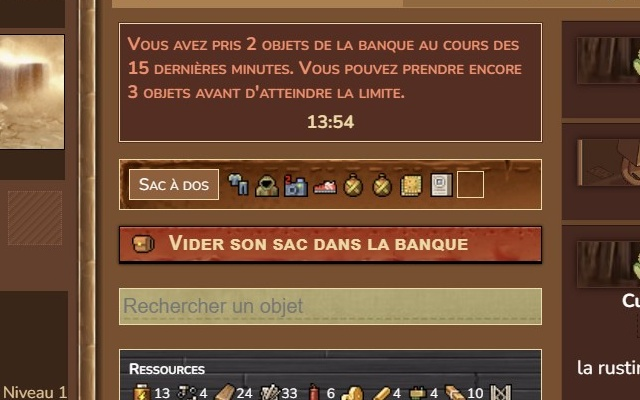
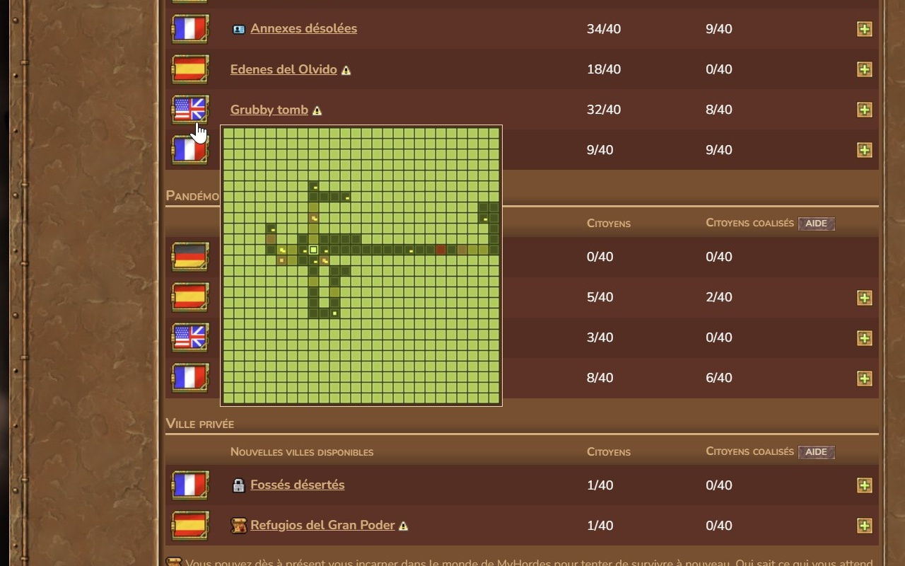
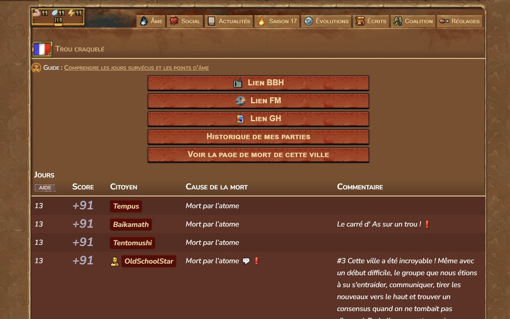
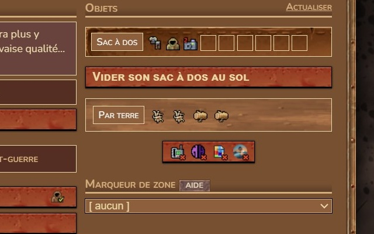
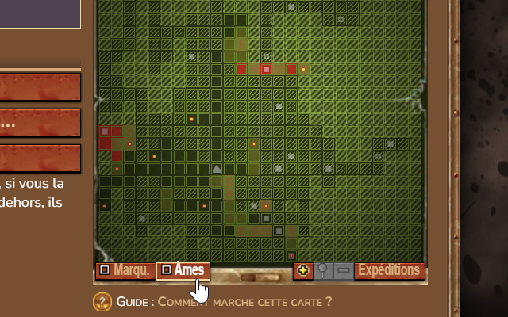
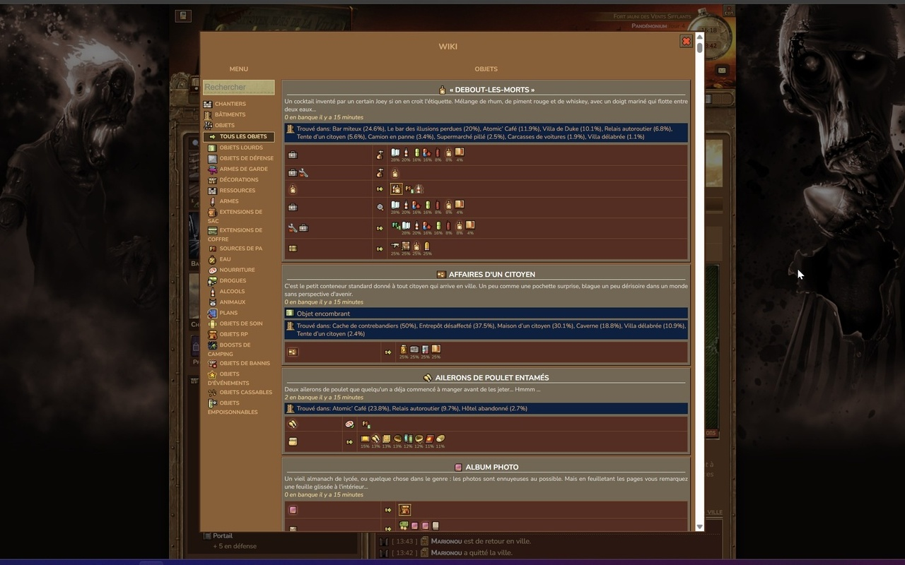
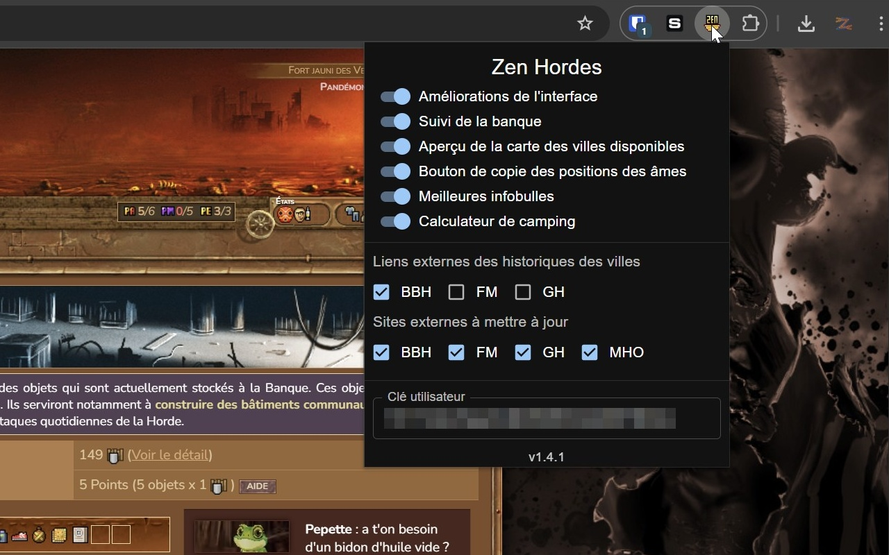

# Zen Hordes


Zen Hordes is a browser extension designed to enhance your experience on the MyHordes game website. This extension provides a variety of features to improve the user interface, manage your interactions with the game's city bank, and offer translations for different languages.

## Installation

Zen Hordes is available as a browser extension for Google Chrome and Mozilla Firefox. You can install the extension from the respective browser stores using the following links:

- [Google Chrome](https://chromewebstore.google.com/detail/zen-hordes/mfmegmfbgapnopkjfocndlkbdapaogam)
- [Mozilla Firefox](https://addons.mozilla.org/en-US/firefox/addon/zen-hordes/)

## Building the Extension

To run the extension locally, you can follow these steps:

1. Clone the repository:

```bash
git clone https://github.com/Zenoo/zen-hordes.git
```

2. Install the dependencies:

```bash
pnpm install
```

3. Build the extension:

```bash
pnpm build:chrome
# or
pnpm build:firefox
```

The file `dist.zip` will be generated at the root of the project. You can then submit this file to the browser store for review or load it as an unpacked extension in your browser.

## Key Features

### User Interface Enhancements
Zen Hordes offers several UI enhancements to make your experience on the MyHordes game website more enjoyable. These enhancements include improved layouts, better visibility of important information, and overall a more streamlined interface. Here is a list of the current UI modifications:
- City data next to the in-game clock
- Outside layout
- Citizen list layout
- Tabs alignment
- Counters alignment
- Citizen home layout
- Heroic actions popup layout
- Town dashboard layout
- Action points layout
- ... and more!

### Bank Tracker
One of the standout features of Zen Hordes is the Bank Tracker. This feature helps you manage your interactions with the game's city bank by notifying you of the number of items you can take within a specified period. A timer and item counter is displayed above the city bank. This helps in managing resources more effectively and prevents accidental overuse.



### Map Preview
Zen Hordes provides a map preview feature that allows you to see the map of available cities in the game. This feature gives you a visual representation of the cities and their locations, making it easier to plan your strategies and jump more efficiently.



### External City Links
Zen Hordes includes a feature that provides quick access to external sites related to the game. These external city links allow you to easily navigate to additional resources and tools that can enhance your gameplay experience. You can customize which external sites are available through the extension's settings.



### External Site Updater

The extension includes a button to update external sites with the current city data. This feature is useful for external sites that rely on the MyHordes API to display city information. By clicking the button, you can ensure that the external sites have the most recent data available.



### Shaman Souls Button

Zen Hordes provides a button to quickly copy the Shaman Souls locations from below the town map. The locations can then be pasted on the town's forom. Keep in mind the locations given are the south-east corner of the souls, meaning the actual soul location can be in a 2x2 square around the given coordinates.



### Wiki

Zen Hordes includes a button in the bottom right corner of the page that allows you to quickly access the MyHordes wiki. This feature provides you with easy access to the game's items, buildings, ruins and much more. The wiki is a valuable resource for players looking to learn more about the game mechanics. Pressing H while hovering over an item will open the wiki page for that item.



### Camping calculator

Zen Hordes provides a camping calculator that helps you determine the chances of surviving a night in the desert. This feature is particularly useful for players who want to plan their camping strategies and maximize their chances of survival. The calculator takes into account various factors such as the number of players, the time of day, and muche more.

### Translations
Zen Hordes supports multiple languages, including English, French, German, and Spanish. The extension automatically detects your preferred language and provides translations for various elements on the MyHordes game website. This ensures that you can navigate and use the site comfortably in your preferred language.

### Customizable Settings
The extension allows you to customize various settings according to your preferences. You can enable or disable specific features such as UI enhancements and the Bank Tracker. All settings are stored locally on your device and in your Chrome cloud storage, ensuring that your preferences are preserved across sessions and devices.


